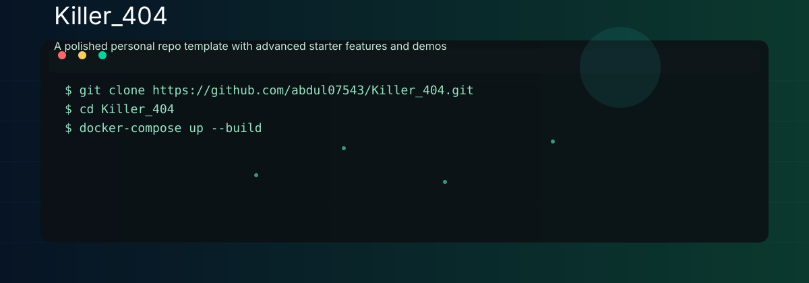

# Killer_404

<p align="center">
  
</p>

<p align="center">
  <a href="#about-me"><strong>About Me</strong></a>&nbsp;•&nbsp;
  <a href="#features"><strong>Features</strong></a>&nbsp;•&nbsp;
  <a href="#projects"><strong>Projects</strong></a>&nbsp;•&nbsp;
  <a href="#demo"><strong>Demo</strong></a>&nbsp;•&nbsp;
  <a href="#contact"><strong>Contact</strong></a>
</p>

---

<p align="center">
  
  
  
  
  
</p>

## About Me

Hi — I'm Killer (GitHub: `@abdul07543`). I build modern, practical applications with a focus on clean code, great UX, and rapid iteration. This repo is a personal showcase and starter collection for advanced small projects and demos.

- 🔭 I build Python apps, full-stack demos, and responsive front-ends.
- 🌱 Currently exploring mobile & cross-platform app development and automation.
- ⚡ I value readable code, polished UI, and fast feedback loops.

## Features (Advanced & Ready-to-run)

This README includes a compact, working developer workflow and demo guidance. The projects in this repo are intended to be:

- Fully containerized (Docker) for reproducible local runs.
- Easy to start with a one-line quick start.
- Deployable to small VPS or cloud with Docker Compose.
- Instrumented with a simple web dashboard and example CLI utilities.

Planned/Example advanced features to include (use as checklist):

- Local web dashboard (Flask/FastAPI) with authentication and live logs.
- Background worker pattern (Celery/RQ) to run automation tasks.
- Mobile-friendly front-end (Flutter / responsive HTML) and offline caching.
- CI: GitHub Actions for tests and Docker image building.
- Docker Compose stack with optional PostgreSQL / Redis service.

## Projects

- Killer_404 — This README & starter assets (hero + advanced README template)
- Example Web App — A Flask/FastAPI demo with lightweight dashboard (see /webapp)
- Automation Tools — Python CLI scripts for common automation tasks (see /tools)

(Add each project folder with README and run instructions.)

## Quick start (example)

1. Clone this repo

```bash
git clone https://github.com/abdul07543/Killer_404.git
cd Killer_404
```

2. Run with Docker (recommended)

```bash
# build and bring up the stack
docker-compose up --build
```

3. Run locally (Python example)

```bash
python -m venv venv
source venv/bin/activate  # or .\venv\Scripts\activate on Windows
pip install -r requirements.txt
python webapp/app.py
# Visit http://localhost:5000
```

4. Run a CLI tool

```bash
# demos/tool_example.py is a sample CLI
python tools/tool_example.py --help
```

## Demo & Screenshots

The hero image above is an SVG included in `assets/hero.svg` to give the README a clean, unique, and stylish visual. Replace it with your photo or a PNG if you prefer — just add it to `assets/hero.(png|jpg)` and update the path.

## Developer notes (how it's structured)

- webapp/ — sample Flask/FastAPI web dashboard
- tools/ — small Python CLI tools and automation scripts
- docker/ — Dockerfiles and docker-compose.yml for reproducible runs
- assets/ — images and svg used by the README and demos

## Contributing

Contributions are welcome. To contribute:

1. Fork the repo
2. Create a branch: `git checkout -b feat/awesome`
3. Commit your changes: `git commit -am "Add awesome feature"`
4. Push to the branch and open a pull request

## Contact

- GitHub: [@abdul07543](https://github.com/abdul07543)
- Email: add-your-email@example.com

## License

This repository is unlicensed by default — add a LICENSE file (MIT recommended) if you want to open-source this content.

---

Made with ❤️ — keep building.
